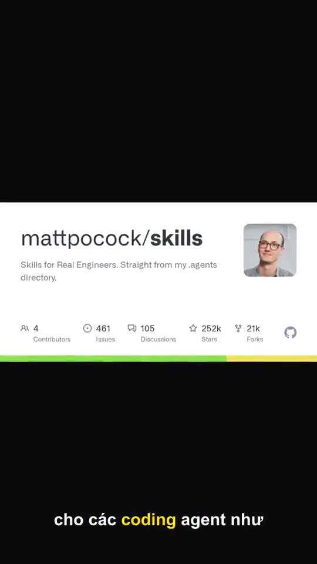

# omaishort

Paste a story, a news URL, a topic, or a GitHub README. omaishort writes voiceover, stills, karaoke captions, and a **1080×1920 @ 30fps** short.

**Drama** is the short-story video (locked faces, motion). **News** and **knowledge** are editorial still collages (ảnh ghép) — not character cinema.

| Kind | Paste | Picture | Voice / motion |
| --- | --- | --- | --- |
| `drama` | **default:** user names people/events, told in viral humiliation→reveal→karma shape; **custom:** prompt is a different story from scratch | Character Bible faces | dialogue or narrator; I2V when keyed, else punch-in Ken Burns |
| `news` | article URL or brief | article photos, then Wikimedia — **ảnh ghép** | narrator + Ken Burns |
| `knowledge` | “thuyết minh về …”, wiki topic, or GitHub URL | editorial stills per beat — **ảnh ghép** | narrator (script first) + Ken Burns |

Legacy `kind=brief` aliases to `news`.

## Demo

Both clips are real CLI renders (`kind=knowledge`, `--language vi`). Click the poster or the video.

<table>
  <tr>
    <td align="center" width="50%">
      <p><b>Lịch sử</b> — Lý Thường Kiệt</p>
      <a href="docs/demo/knowledge-history.mp4">
        
      </a>
      <br />
      <video src="docs/demo/knowledge-history.mp4" width="270" controls playsinline></video>
    </td>
    <td align="center" width="50%">
      <p><b>How-to</b> — mattpocock/skills</p>
      <a href="docs/demo/knowledge-skills.mp4">
        
      </a>
      <br />
      <video src="docs/demo/knowledge-skills.mp4" width="270" controls playsinline></video>
    </td>
  </tr>
</table>

If the player is empty on GitHub, open the files:

- [docs/demo/knowledge-history.mp4](docs/demo/knowledge-history.mp4) (~97s)
- [docs/demo/knowledge-skills.mp4](docs/demo/knowledge-skills.mp4) (~106s)

```powershell
# History topic (Wikipedia + ChatGPT VO)
.\.venv\Scripts\python.exe -m omaishort "thuyết minh về Lý Thường Kiệt" --kind knowledge --language vi

# GitHub README (facts from the repo, not a video-factory template)
.\.venv\Scripts\python.exe -m omaishort "https://github.com/mattpocock/skills" --kind knowledge --language vi
```

## Pipeline

```
kind=drama|news|knowledge
  → analyze (bible + five beats)
  → plan (1 still / scene, 1–3 Ken Burns shots)
  → refs → stills → tts → rescale to real audio
  → karaoke ASS + optional BGM duck
  → I2V when keyed, else Ken Burns → 1080×1920 MP4
```

Beats are always `hook → conflict → rising_action → twist → ending`. News maps those to headline / obstacle / unfold / turn / outcome. Knowledge maps them to claim / proof / context / misconception / remember.

A scene is **one still**, not one image per sentence. Drama may I2V that still. News/knowledge Ken Burns only — never labeled as I2V.

## Layout

| Path | Role |
| --- | --- |
| `apps/api` | FastAPI + engine + CLI |
| `apps/web` | Vite studio (paste → poll stages → download MP4) |
| `apps/remotion` | reads `timeline.json` only; FFmpeg is the renderer |
| `packages/schema` | Pydantic + JSON Schema |
| `prompts/` | analyzer / planner / knowledge script / stills |
| `samples/` | drama, news, knowledge pastes |
| `docs/demo/` | illustration MP4s for this README |
| `tests/` | pytest |
| `.cursor/skills` | agent skills |
| `.cursor/rules` | pipeline + quality bar |

Job files live in `data/jobs/` (gitignored). Do not commit `.env`, venv, or generated MP4s.

## Setup (Windows)

```powershell
cd D:\tool\lonton\omaishort\apps\api
python -m venv .venv
.\.venv\Scripts\activate
pip install -r requirements.txt -r requirements-dev.txt
python -m playwright install chromium
```

```powershell
cd D:\tool\lonton\omaishort\apps\web
npm install
npm run dev
```

```powershell
cd D:\tool\lonton\omaishort\apps\api
python run.py
```

Copy `.env.example` to `.env`. Studio: `http://127.0.0.1:5173` (proxy → API `:8765`).

### ChatGPT for knowledge VO

Knowledge topics and GitHub READMEs ask ChatGPT to write `script.json` **before** stills. First login (headed Chrome, once):

```powershell
cd D:\tool\lonton\omaishort\apps\api
.\.venv\Scripts\python.exe -m omaishort --chatgpt-login
```

Session is stored under `data/chatgpt-web/profile` (gitignored). Later jobs stay **headless** and reuse **one ChatGPT thread per day** (`data/chatgpt-web/daily.json`). Wiki / README notes are the fallback if ChatGPT is off.

Gemini / similar image sites: do not scrape the Gemini UI the same way. Still images use HTTP adapters — Pollinations (no key), then Gemini API if `GEMINI_API_KEY` is set, then OpenAI images. The login-once Playwright pattern is for ChatGPT **text**, not image carousels.

Optional: set `OPENAI_BASE_URL` + `OPENAI_API_KEY` for an OpenAI-compatible HTTP model (used after ChatGPT web).

## Commands

Run from `apps\api`. Do **not** copy a leading `>` from docs — PowerShell treats that as a command.

```powershell
cd D:\tool\lonton\omaishort\apps\api

# Drama
.\.venv\Scripts\python.exe -m omaishort ..\..\samples\confession-60s.md --voice en-female-us

# Knowledge — topic
.\.venv\Scripts\python.exe -m omaishort "thuyết minh về Lý Thường Kiệt" --kind knowledge --language vi

# Extra writing notes for ChatGPT (tone / emphasis)
.\.venv\Scripts\python.exe -m omaishort "thuyết minh về Lý Thường Kiệt" --kind knowledge --language vi --script-brief "giọng tài liệu, nhấn trận Khâm Ung Liêm, đừng kể gia phả"

# Knowledge — GitHub README
.\.venv\Scripts\python.exe -m omaishort "https://github.com/mattpocock/skills" --kind knowledge --language vi

# News — article URL
.\.venv\Scripts\python.exe -m omaishort "https://vnexpress.net/..." --kind news --language vi

# Sample pastes
.\.venv\Scripts\python.exe -m omaishort ..\..\samples\knowledge-topic.md --kind knowledge --language vi
.\.venv\Scripts\python.exe -m omaishort ..\..\samples\brief-60s.md --kind knowledge --language vi
```

Output: `data/jobs/dryrun-<id>/render/short.mp4`. `script.json` should show `"provider": "chatgpt-web"` when ChatGPT wrote the VO.

Skip slow I2V queues for a Ken Burns-only dry-run:

```powershell
$env:HF_I2V_ENABLED = "0"
$env:POLLINATIONS_VIDEO_ENABLED = "0"
$env:WAVESPEED_ENABLED = "0"
```

## API

`POST /jobs` · `GET /jobs/{id}` · `GET /jobs/{id}/artifacts` · `GET /jobs/{id}/download` · `GET /health` · `GET /providers`

Stages: `analyze → plan → refs → stills → tts → captions → render`

## Providers

| Stage | Order |
| --- | --- |
| Script (knowledge) | ChatGPT web → OpenAI-compatible HTTP → wiki / README notes |
| Image | Pollinations → Gemini API (if `GEMINI_API_KEY`) → OpenAI images → placeholder |
| Motion | HF Spaces (needs `HF_TOKEN`) → WaveSpeed Wan (if `WAVESPEED_API_KEY`) → Pollinations Wan (`POLLINATIONS_KEY`) → Ken Burns |
| TTS | ElevenLabs → edge-tts → silence |

Planner never imports a vendor SDK. Do not use Pexels. Do not fork MoneyPrinter / OpenMontage / HyperFrames into this tree.

## Tests

```powershell
cd D:\tool\lonton\omaishort
.\apps\api\.venv\Scripts\python.exe -m pytest -q
cd apps\web
npx tsc --noEmit
```

## Docs

- Product: [docs/REQUIREMENTS.md](docs/REQUIREMENTS.md)
- Research notes: [docs/RESEARCH.md](docs/RESEARCH.md)
- Roadmap: [docs/ROADMAP.md](docs/ROADMAP.md)
- Agent entry: [AGENTS.md](AGENTS.md)
