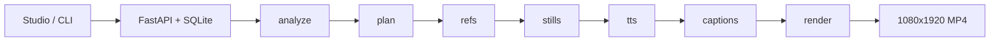

# Requirements — omaishort

**Product:** local-first Story Video Engine. **Drama** is the short-story video (bible faces, motion). **News** and **knowledge** are editorial **still collages** (ảnh ghép) with narrator VO. One pipeline, three kinds. Not a TikTok clone. Not a fork of MoneyPrinter, OpenMontage, or HyperFrames.

This file is the **product contract**. Schema (`packages/schema/omaishort_schema/models.py`) is the type source. Code that disagrees with this file is a bug — unless the same PR updates both.

| Doc | Role |
| --- | --- |
| This file | What a short **must** be; numbers and routing |
| [RESEARCH.md](RESEARCH.md) | Why: contracts stolen, repos not forked |
| [ROADMAP.md](ROADMAP.md) | Later work — do not implement in an unrelated change |
| `.cursor/rules/quality.mdc` | Quality bar (intent). This file has the exact tables |
| `.cursor/rules/pipeline.mdc` | Agent pipeline rules |

---

## 0. Invariants

A change is out of product if it breaks any of these.

1. Output is always **1080×1920 @ 30fps**. Duration of `render/short.mp4` equals **probed VO** (not the input `target_seconds` after TTS).
2. **One still per scene.** Every shot in that scene shares `still_id`. Schema rejects mixed stills. Never one image per sentence.
3. Beats are always `hook → conflict → rising_action → twist → ending`. Drama is a **short story**, never a fun-fact / explainer arc. News/knowledge reuse those keys as editorial labels only.
4. Drama faces come from the **Character Bible passport**, not a new description. Drama should **move** (close-up lenses; I2V when keyed). News/knowledge are **ảnh ghép**: uninhabited editorial stills + Ken Burns; `characters=[]`, `use_face_ref=false`.
5. Ken Burns is never labeled I2V. `timeline.elements[].type` is `video` only for a real I2V clip. Write `render/motion.json` = `kenburns` | `i2v` | `mixed`.
6. Planner never imports a vendor SDK. Image/video/TTS/LLM sit behind protocols.
7. No Pexels. No HyperFrames HTML templates. No Gemini/Midjourney **UI** scrape. No AGPL vendoring.
8. Secrets stay in `.env`. CI never needs keys. Do not commit `data/jobs/` (demo MP4s live only in `docs/demo/`).

---

## 1. Problem

Creators need **one** 1080×1920 short from a paste.

| Kind | What it is | Must produce | Must not produce |
| --- | --- | --- | --- |
| `drama` | Short story video. **Default:** user still names people and events; the tell follows the viral humiliation → reveal → karma shape. **Custom:** a prompt that is its own story, not that shape | Same bible faces/clothes; continuous five beats; motion (I2V if keyed) | Fun-fact beats; new face per sentence; treating drama as a photo slideshow |
| `news` | **Ảnh ghép** — article stills + Ken Burns, narrator | Full article through the **ending**; stills match each beat | Character bible faces; close-up punch-ins; Pexels; stop at first conflict |
| `knowledge` | **Ảnh ghép** — editorial stills + Ken Burns, narrator; VO written first | Five-beat explainer; `script.json` before stills; stills match VO | Echo “thuyết minh về…”; wiki genealogy dump; trivia listicle; on-camera couple |

Legacy `kind=brief` **aliases to `news`**. Do not add a fourth product kind. Do not turn news/knowledge into drama faces.

### Drama: default shape or custom prompt

Two modes, same engine (bible faces, five beats, motion). The user **always** can say who the people are and what happens.

1. **Default (viral shape)** — the paste / `script_brief` supplies **characters and events**. The analyzer tells that material in the stock short-drama **shape** (not a random new plot):

| Beat | Shape | Craft |
| --- | --- | --- |
| hook | Public humiliation in 5–15s | Shock, toxic line, crowd, hint the tables will turn |
| conflict | Humiliation deepens | Protagonist stays quiet; crowd laughs |
| rising_action | Tension | Strange calm, witnesses, CCTV / livestream |
| twist | Status reveal | The underestimated person holds real power |
| ending | Karma + cold quote | Social punishment (fired, banned, viral shame) — not a brawl **in this shape** |

   Example: user names a poor-looking guest and an arrogant host at a hotel → still **their** people and place, told as humiliation → reveal → karma. Language follows `language` (`en`/`vi`).

2. **Custom** — the prompt is a **different story from scratch**, not mapped onto that shape (confession kitchen, Ngộ Không vs Na Tra fight, any arc they write). Five beat **keys** stay for the camera; the arc is theirs. Do not bend a custom prompt into humiliation/reveal/karma.

Mode: use **custom** when the paste clearly asks for another genre/arc (`script_brief`, fight, confession script, `Name: line`). Use **default shape** when they give people/setting but no other structure — fill their facts into the viral shape.

---

## 2. Users

| User | Job | Surface |
| --- | --- | --- |
| Creator | Paste, wait, download MP4 | Studio `apps/web` |
| Operator | Run API/CLI, keys, `--chatgpt-login` | `python -m omaishort`, `.env` |
| Agent | Change pipeline without breaking bible / scene / timeline | This file + `AGENTS.md` |

---

## 3. Glossary

| Term | Meaning |
| --- | --- |
| Character Bible | Stable ids (`wife`, `husband`, `narrator`) + lockable appearance/clothing. News/knowledge = narrator-only |
| Scene | `duration_sec` + unique `still_id` + 1–3 `shots` that **must** share that still |
| Beat | One of five keys in `StoryStructure`. Editorial **maps labels** but keeps the same keys |
| Beat lenses | Camera/motion pairs in `engine/fallback.py`. Drama uses close_up punch-ins. Editorial collage stays medium/wide |
| Ken Burns | FFmpeg zoompan, working frame **2160×3840**, cosine ease, 1080×1920 out. Zoom amplitude: wide 0.04, medium 0.05, close_up 0.12 (drama only) |
| I2V | Real MP4 from a still (HF Spaces / WaveSpeed HTTP / Pollinations Wan). One clip **per scene**, not per shot |
| `script_brief` | Optional ≤2000 chars, stripped blanks → `None`. Sent to ChatGPT as `USER_BRIEF=` |
| `script.json` | Knowledge VO + `provider` (`chatgpt-web` / HTTP llm / `wiki` / `github`) + `note` + optional `script_brief` |
| Topic paste | Knowledge input that is **not** already five authored beats. See §7 |

---

## 4. Input contract

`POST /jobs` body and CLI both validate `StoryInput`.

| Field | Rule |
| --- | --- |
| `kind` | `drama` \| `news` \| `knowledge`. `brief` → `news` |
| `mode` | `script` \| `idea` |
| `text` | min 8 chars after fetch |
| `target_seconds` | 15–180. Schema default **60**. CLI `--seconds 0` → **90** news/knowledge, **60** drama. Studio sets 90 when switching to news/knowledge |
| `language` | `en` / `vi` (others may exist on TTS; product is en/vi) |
| `voice_id` | Catalog id or `None`. Blank string → `None` → language default (`vi-female` / `en-female-us`) |
| `source_url` | Article or GitHub URL; blank → `None` |
| `script_brief` | max 2000; blank → `None` |
| `genre` | Drama: confession/family/cheating/revenge/twist/drama. News paste with a drama genre **coerces to `news`**. Knowledge coerces to `knowledge` unless already `news` |
| Spoken clamp | Editorial VO word budget uses ~**3.15 vi / 2.7 en** words per second. Hard ceiling **600s** in fallback; API never accepts >180 |

CLI extra: a URL as the story argument with default `kind=drama` becomes **knowledge** if GitHub, else **news**. vnexpress/tuoitre/thanhnien/dantri/vietnamnet with `language=en` → `vi`.

---

## 5. Pipeline and artifacts

Stages (studio labels = `JobStage`): `analyze → plan → refs → stills → tts → captions → render`.

Knowledge **topic** or GitHub URL inserts a **script** step *before* analyze (progress `script`, artifact `script.json`). If `provider` is `chatgpt-web` or `llm`, analyze+plan use `fallback_analyze` / `fallback_plan` on that VO (do not re-ask the LLM to invent a second script).

Job dir `data/jobs/<id>/` (gitignored):

| File | When |
| --- | --- |
| `script.json` | Knowledge topic / GitHub |
| `bible.json` | Always after analyze |
| `structure.json` | Always after analyze |
| `storyboard.json` | After plan; rewritten after TTS rescale |
| `timeline.json` | After captions; Remotion **reads only this** |
| `render/short.mp4` | Done |
| `render/motion.json` | `kenburns` \| `i2v` \| `mixed` |
| `refs/` `stills/` | Passport + scene stills |

API: `POST /jobs`, `GET /jobs/{id}` (`public_job()` — no raw `*_json` leak), artifacts, download, `/health`, `/providers`, `/voices`.

---

## 6. Beats, scene counts, lenses

News maps keys to: headline / obstacle / unfold / turn / outcome.  
Knowledge maps keys to: claim / proof / context / misconception / remember.  
JSON field names stay the five drama keys.

| Kind | Scene count | Notes |
| --- | --- | --- |
| Drama | 8–15 (fallback `round(target_seconds/6)` clamped 8–15). LLM plan rejected if `target_seconds ≥ 45` and scenes < 6 | Dialogue scripts must keep `speaker_id` |
| News / knowledge | **Exactly 5** (one still per beat). LLM plan rejected if not 5 | `clamp_brief_storyboard` trims VO to word budget |

`normalize_storyboard` **always** overwrites shots with beat lenses. Do not leave random hold/zoom from the LLM.

**Drama lenses** (`_BEAT_LENSES`) — two shots per scene:

| Beat | Shot 1 | Shot 2 |
| --- | --- | --- |
| hook | medium + zoom_in | close_up + zoom_in |
| conflict | medium + hold | close_up + zoom_in |
| rising_action | wide + pan_right | medium + zoom_in |
| twist | close_up + hold | close_up + zoom_in |
| ending | medium + hold | wide + zoom_out |

**Editorial lenses** (`_BEAT_LENSES_EDITORIAL`) — medium/wide only (letterboxed photos; skip close_up punch-in):

| Beat | Shot 1 | Shot 2 |
| --- | --- | --- |
| hook | medium + hold | medium + zoom_in |
| conflict | medium + hold | medium + zoom_in |
| rising_action | wide + pan_right | medium + hold |
| twist | medium + hold | medium + zoom_in |
| ending | medium + hold | wide + zoom_out |

If you change a pair, change `fallback.py` **and** this table in the same PR. Tests must cover `apply_beat_lenses`.

---

## 7. Kind routing (knowledge / news)

**Knowledge topic** (`is_knowledge_topic`) is true when the paste is not a URL **and** not already five paragraphs of ≥8 words each, **and** either a topic prefix/tail (“thuyết minh về…”, “explain…”) **or** ≤40 words and ≤3 sentences.

Then: `fetch_knowledge_topic` (wiki extract) → `write_knowledge_script` (ChatGPT web → OpenAI-compatible HTTP → wiki). `script_brief` → `USER_BRIEF`. Spoken lines need real sentence stops (`ensure_spoken_stops`).

**GitHub URL:** `kind` becomes knowledge. Facts from README notes (`github_readme_notes`) — not a video-factory template. If ChatGPT fails, `knowledge_spoken_from_notes`; `provider` may be `github`.

**News URL:** fetch article text + publisher photos. Cover **outcome**. Do not stop at conflict.

**ChatGPT web:** headed `--chatgpt-login` once; later jobs headless; **one** `chatgpt.com/c/…` thread per calendar day (`data/chatgpt-web/daily.json`). Not a clone of ChatGPT-Web2API. Timeout → HTTP then wiki; `script.json.note` says why.

---

## 8. Pictures

### Drama

- Scene `characters` ⊆ bible ids = people **on camera**.
- Compact image prompt leads with **ONLY those ids**. Clothing/appearance from bible + scene fields.
- Kontext from passport **URL**, not a re-described face.
- `use_face_ref=false` when back-turned, distant, face hidden, or insert (phone/hands). Inserts: no full-body crowd.
- Location/prop bible: reuse `location_id`; `use_location_ref=false` on phone/insert/hands.
- I2V when keyed (one clip per scene) — this is the drama motion path. Else punch-in Ken Burns (close_up allowed).

### News / knowledge (ảnh ghép)

Waterfall per beat (`assign_editorial_stills`):

1. Early beats (first two): unused **article** photos from `source_url` when present.
2. Later beats: leftover article photo only if caption/path **overlaps** the beat VO (score ≥ 0.08).
3. Else **per-beat** Wikimedia / Openverse terms (MoneyPrinter-style search terms, not Pexels).
4. Else generated editorial (Pollinations → Gemini API if keyed → OpenAI → placeholder).

Generated compact prompt leads with uninhabited editorial still — **zero people, zero faces, zero couple**. Letterbox wide photos into 9:16.

### Image chain

Pollinations (Flux/Kontext) → Gemini HTTP (`GEMINI_API_KEY`) → OpenAI images → placeholder. Comfy stub only when a photograph is **not** required. Photo providers on + non-photo return → **fail the still**, do not mix stick figures. `POLLINATIONS_ENABLED=0` → geometric OK.

---

## 9. Voice, captions, motion

| Stage | Contract |
| --- | --- |
| TTS | ElevenLabs if keyed, else edge-tts (chunk ~**900** chars, ffmpeg concat, then delete parts), else silence. `join_scene_narration` + sentence stops |
| Voices | Catalog in `providers/tts.py` (`vi-female/male`, `en-*-us/uk/au`). `GET /voices`; studio fallback list if API down |
| Rescale | After TTS, scene `duration_sec` + shot windows **sum to probed audio** (`engine/rescale.py`) |
| Captions | WordBoundary from edge-tts → faster-whisper → even-split → ASS. `SubtitleStyle` (default font 64, highlight karaoke, margin_v 120) |
| Mix | Optional BGM = first **audio** file in `assets/music/` (not README), ducked under VO. Optional logo `mix.logo_enabled` |
| I2V | **Drama:** HF Spaces (`HF_TOKEN`), WaveSpeed Wan (`WAVESPEED_API_KEY`), or Pollinations Wan (`POLLINATIONS_KEY`), one clip per scene. **News/knowledge:** Ken Burns only (collage). Motion prompt = camera + action only — no VO text |

---

## 10. Functional requirements

Each FR is observable on a finished job or a unit test.

**FR1 Beats** — Analyze + plan emit the five keys. `normalize_storyboard` applies §6 lenses.

**FR2 Identity vs editorial** — §8.

**FR3 Still budget** — Unique `still_id` per scene; shots share it; shot count ≥ 2× scene count after lenses (two shots per beat). Do not recycle one mugshot onto a later beat that talks about something else.

**FR4 Face-ref** — Off when back-turned / distant / hidden / editorial.

**FR5 Audio clock** — §9 rescale.

**FR6 Stages** — §5. Studio `PIPELINE_STAGES` matches.

**FR7 API** — §5 routes. `StoryInput` is the POST body.

**FR8 Dry-run / photo honesty** — No cloud keys still write MP4. Photo path fails closed.

**FR9 Knowledge script-first** — §7. `script.json` exists before stills on topic/GitHub jobs.

**FR10 Motion honesty** — §0 (Ken Burns ≠ I2V) and §9.

**FR11 Voice** — `voice_id` through CLI `--voice` and studio Voice select.

**FR12 Image HTTP chain** — §8. No UI scrape.

---

## 11. Non-functional

| ID | Quality | Requirement |
| --- | --- | --- |
| NFR1 | Platform | Local-first Windows. FFmpeg from PATH or `imageio-ffmpeg` |
| NFR2 | Architecture | Protocols only. Planner must not import vendor SDKs |
| NFR3 | Security | `.env` gitignored. CI without keys |
| NFR4 | Output | 1080×1920, 30fps, duration = probed VO |
| NFR5 | i18n | Product `en`/`vi`. Vietnamese **docs** OK; code identifiers English |
| NFR6 | Test | Engine tests do not call ComfyUI, ElevenLabs, or live ChatGPT |
| NFR7 | ChatGPT | One `/c/` per calendar day; jobs headless after login |
| NFR8 | Failure | `script.json.note` and job `error` explain wiki/image/TTS miss. Studio polls JSON (no websocket) |

---

## 12. Out of scope

See [ROADMAP.md](ROADMAP.md). Do not pull these into an unrelated PR.

- P3: review gates, contact sheet, `POST /jobs/{id}/approve`, locked `render_runtime`
- P4: I2V already has Ken Burns fallback — do not invent a new motion product
- P5: named gateway presets (`ollama` / `openrouter` as first-class config)
- P6: Part 1..N factory, “scene 5 darker” edit-agent, Redis queue
- Never default: Pexels; HyperFrames; AGPL copy; auto social upload; Gemini/Midjourney UI scrape

---

## 13. Acceptance

- `pytest -q` from repo root
- `npx tsc --noEmit` in `apps/web`
- `python -m omaishort samples/confession-60s.md` → MP4 1080×1920 with audio
- `python -m omaishort samples/knowledge-topic.md --kind knowledge --language vi` → explainer; `script.json` names provider; no on-camera bible faces
- `python -m omaishort samples/brief-60s.md --kind knowledge --language vi` → narrator-only
- News URL (`--kind news`) covers the article ending; stills match beats (article → CC search → generate)
- Storyboard: unique `still_id` per scene; shots share it; after lenses, two shots per scene
- `--script-brief` appears in `script.json` and in the ChatGPT user blob as `USER_BRIEF=`
- `render/motion.json` exists; Ken Burns jobs are not `type=video` on stills

---

## 14. Stack

Python 3.11, FastAPI, Pydantic v2, SQLite, Vite + React, FFmpeg. Optional: Playwright ChatGPT web, Gemini image HTTP, OpenAI-compatible LLM, ComfyUI, ElevenLabs, faster-whisper, HF Spaces, WaveSpeed HTTP, Pollinations Wan.

---

## 15. Change gate

Same PR must update this file when you change: beat lens pairs, scene counts, still waterfall, ChatGPT session rules, image/TTS/video provider **order**, `StoryInput` fields, or job stages.

Do **not** “fix quality” by adding a new product surface (new kind, new UI app, new stock provider). Fix identity (bible → kontext) or motion (I2V keys / Ken Burns lenses).
