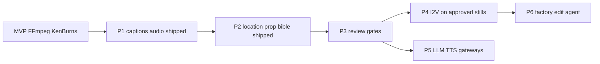

# Roadmap — elevate omaishort

Do not implement a whole foreign product. Each phase is one contract plus one provider. Product stays [REQUIREMENTS.md](REQUIREMENTS.md). Sources: [RESEARCH.md](RESEARCH.md).

## P0 — shipped

Analyzer, bible, planner (1 still / scene, multi-shot), placeholder/Comfy/OpenAI images, edge-tts, rescale, ASS, FFmpeg 1080×1920, studio UI, pytest, CI.

## P1 — Captions and mix (MoneyPrinterTurbo) — shipped

Goal: karaoke that matches the voice, not an even word-split.

- Prefer **edge-tts word timestamps** (`Communicate.stream` + `WordBoundary`); Whisper, then even-split, only if needed.
- ASS style knobs: font, size, fill, outline, margin via `SubtitleStyle` / `.env`.
- BGM: first audio file in `assets/music/` (not README), volume, **duck under VO** (`sidechaincompress`, volume `amix` fallback).

Done when: dry-run captions track the spoken words closer than even-split; BGM does not bury VO.

## P2 — Location and prop bible (ArcReel clues) — shipped

Goal: kitchen stays the same kitchen.

- Bible: `locations[]` and `props[]` (`AssetRef` + `reference_image`), same pattern as characters.
- Scene: `location_id`, `prop_ids`, `use_location_ref` (false for phone/insert/hands).
- Location passport stills in `data/jobs/<id>/refs/locations/`; props in `refs/props/`.
- Fallback planner reuses the same `location_id` for the same location string / kitchen keyword.

Done when: two scenes in the same kitchen share one location still id or one location ref in the prompt.

## P3 — Review gates (OpenMontage Backlot, FTL judge)

Goal: do not encode a bad face.

- After `stills` stage, job can sit in `awaiting_review` with a contact sheet (all stills + scores later).
- API: `POST /jobs/{id}/approve` continues to TTS/render; `POST /jobs/{id}/regenerate` with `{still_id}` or `{character_id}`.
- Optional vision check: “same person as `refs/wife.png`?” before I2V (FTL). Placeholder path skips the judge.
- Lock `render_runtime: ffmpeg | remotion` on the storyboard; compose must honor it.

Done when: UI can reject one still and only that still regenerates.

## P4 — I2V upgrade (FTL, Story Forge, MoneyPrinter Seedance) — shipped (fallback)

Goal: still becomes a moving clip; Ken Burns remains fallback.

- Provider protocol `VideoProvider`: Hugging Face Wan Fast Space → LTX Space → Pollinations Wan (pollen) → ComfyUI stub → Ken Burns.
- Per scene: if a public start-frame URL exists and I2V returns MP4, one clip covers the scene; else zoompan per shot.
- Motion prompt = camera + action only. Identity comes from the still, not a new face description.
- Pollinations video is **paid pollen** (`POLLINATIONS_KEY`). Anonymous image API cannot emit Wan clips.
- ZeroGPU needs `HF_TOKEN` (free HF account, ~5 min/day). Anonymous calls often `error null`. Next local adapter: FramePack via Comfy if VRAM ≥6GB — not 4GB laptops.

Done when: one scene can be I2V while neighbors stay Ken Burns, same bible refs.

## P5 — Provider gateway (MoneyPrinterTurbo)

Goal: named LLM/TTS/image backends without planner imports.

- Config presets: `ollama`, `openrouter`, `openai`, `edge`, `elevenlabs`.
- Health: `GET /providers` lists which adapters are live (Comfy ping, key present).
- Batch: `n_candidates` stills per scene, keep first passing QC (AIDrama 2–4 takes).

Done when: switching TTS from edge-tts to ElevenLabs is env-only.

## P6 — Factory and edit-agent

- Part 1..N (60s) with continuity state (character, location, clothing, secret known).
- Natural language: “scene 5 darker” regenerates one still + dependent shots (montage-ai).
- Queue: Redis/RQ when local BackgroundTasks is not enough.

## Won't do (unless asked)

- Default visuals from Pexels.
- Auto-post to TikTok (MoneyPrinter Upload-Post).
- Copying OpenMontage AGPL sources into this tree.
- Replacing FastAPI with agent-only orchestration.
